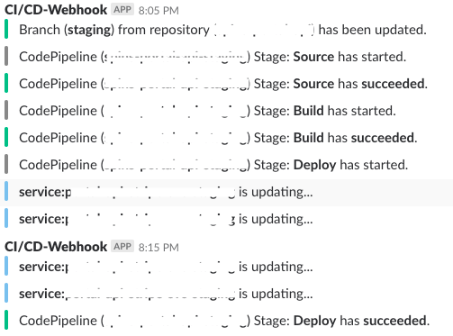
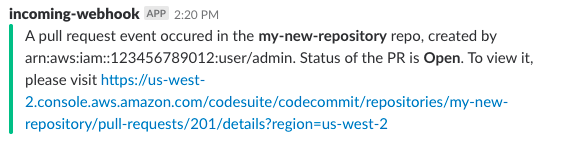

# AWS Services Slack Notifier

This is forked from the original repo from SymphoniaCloud, big thanks to them for this awesome Lambda function. I went in a bit more granular with the events and modified it to my project's needs.

I am using CloudWatch events from CodePipeline (CodePipeline Stage Execution State Change), CodeCommit (CodeCommit Repository Change) and ECS (ECS Task State Change). These three events are incorporated in the `./prebuilt-templates/template-aws-services.yml` file and used in the `./lib/index-AWS-services.js` function.

The other function `./lib/index-CodeCommit-PR.js` uses only CodeCommit events (CodeCommit Pull Request State Change & CodeCommit Comment on Pull Request). These events are set in the other `./prebuilt-templates/template-codecommit-pr.yml`.

 

 

If you have Code Pipelines in multiple accounts / sub-accounts and/or regions then you'll need to deploy this application to each account+region combo that you have your Code Pipelines in.

## Serverless Application Repository App

Still, the easiest way to use this application is via the AWS Serverless Application Repo. You can find it [here](https://serverlessrepo.aws.amazon.com/applications/arn:aws:serverlessrepo:us-east-1:392967531616:applications~CodePipelineSlackNotifier) .

## Prerequisites

* AWS Account using Code Pipeline. Otherwise there's not much point to this. :)
* [Slack](https://slack.com/) account, and an [**incoming webhook**](https://api.slack.com/incoming-webhooks) URL you can use to post to it. This will be something like `https://hooks.slack.com/services/....`
* An AWS user with sufficient privileges to deploy the application from the AWS Serverless Application Repository
* An S3 bucket that you can use as a location of your build artifact. You should have write privileges to this from your AWS user.
* Locally: Node, and an at least relatively recent version of the AWS CLI

## Setup

1. Run the following from a terminal, substituting `YOUR_S3_BUCKET` for the S3 bucket described above, and `YOUR-INCOMING-WEBHOOK-URL` for the Slack URL described above:

    ```bash
    $ npm install

    $ npm run dist

    $ aws cloudformation package --template-file sam.yml --s3-bucket YOUR_S3_BUCKET --output-template-file target/packaged-template.yaml

    $ aws cloudformation deploy --template-file ./target/packaged-template.yaml --stack-name cp-slack-notifier --parameter-overrides SlackUrl=YOUR-INCOMING-WEBHOOK-URL --capabilities CAPABILITY_IAM
    ```

## Use Cases

The way I went was installing the application through the link that the SymphoniaCloud guys provide, and after that edit the Lambdas with the functions that I already mentioned above. Also, I have created custom CloudWatch Events, since editing the ones that will be created by the application popped an error every time I wanted to do that.

Also, one other and maybe the crucial reason I deploy it like this is because when doing all these commands given in the Setup make the `./target/lambda.zip` because of the `node_modules` so the file is more than 10MB. This poses an issue when deploying it by hand - the Lambda can not be edited inline because of this, something that I find very useful and I am sure you do too.

So my proposed way to go is depoy it from the AWS Serverless Application Repo (link above), in this way you will be able to edit the Lambda function inline and make all the changes you want to.

## Testing

For testing, you can go ahead and visit the link below. This is the documentation for all supported AWS services in CloudWatch events, something that I used extensively while testing out all of the scenarios. 

```https://docs.aws.amazon.com/AmazonCloudWatch/latest/events/EventTypes.html```

## Possible extensions / modifications

1. To change which types of events you want to be notified about you can specify a filter within the
Cloudwatch Event rule. For instance, to only notify on failed runs of the pipeline, update the `EventPattern` section
of the `CodePipelineEvent` in the `sam.yml` file as follows:

    ```yaml
      EventPattern:
        source:
        - aws.codepipeline
        detail-type:
        - CodePipeline Pipeline Execution State Change
        detail:
          state:
          - FAILED
    ```

1. Similarly, to only notify for certain pipelines you can use the `pipeline` attribute of the `detail` element.
For more details of event filtering, see the documentation at http://docs.aws.amazon.com/codepipeline/latest/userguide/detect-state-changes-cloudwatch-events.html

1. You can also listen for different, more granular, events within CodePipeline. This is also detailed in the link above.

1. You can perform filtering in code, in the Lambda function, but that will mean your Lambda function
is getting triggered more often, which can lead to increased costs.

1. Another nice extension would be different types of message for different kinds of events, or posting to different channels for different pipelines. Either of these are possible by modifying the message POSTed to Slack. See https://api.slack.com/docs/messages for more details

## Teardown

To teardown the notifier delete the stack through the Web Console, or use the incantation below:

```bash
$ aws cloudformation delete-stack --stack-name cp-slack-notifier
```

-----
Copyright 2017, Symphonia LLC
